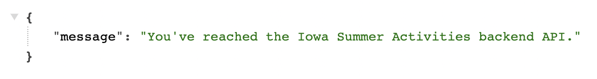
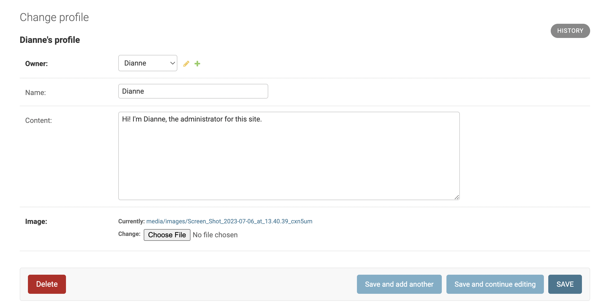

# README file currently being updated / edited

# **Iowa Summer Activities (backend API)**

## Table of Contents

- [Project](#project)
  * [Objective](#objective)
  * [Links to Deployed Project](#links-to-deployed-project)
- [Project Structure](#project-structure)
  * [Developer User Stories](#developer-user-stories)
    + [Profiles](#profiles)
    + [Activities / Events](#events)
    + [Search-NEEDED????](#search)
    + [Comments](#comments)
    + [Followers](#followers)
    + [Reviews](#reviews)
    + [Contact](#contact)
- [Database Design](#database-design)
  * [Models](#models)
- [Features](#features)
  * [Homepage](#homepage)
  * [Profile Data](#profile-list)
  * [Activities / Events Data](#events-list)
  * [Followers Data](#followers-data)
  * [Reviews Data](#reviews-data)
  * [Contact Data](#contact-data)
- [Agile Workflow](#agile-workflow)
  * [Github Project Board](#github-project-board)
- [Testing](#testing)
- [Deployment](#deployment)
- [Credits](#credits)
#

# **Project Overview**

## Objective

This is a website to designed to be a platform for (summer) activities where users can post events happening in Des Moines, Iowa or the surrouding areas to be able to better connect with neighbors and people sharing similar interests.

The Iowa Summer Activities API provides a backend database to create, view, edit and delete information pertaining to the aforementioned events. From the database, users can upload information about an activity (picture, title, description / event info). Other users can then like or review and rate this activity; all users can post comments on an event.

This API includes a search capacity to improve the user experience. Users can search, and therefore filter, by user or by keyword that appears somewhere in the event description or title.

## Links to Deployed Project

  + The backend portion of this project is deployed on Heroku and can be found at: [Iowa Summer Activities API](https://activities-backend-api-a2cb7e703660.herokuapp.com/)
  + The corresponding GitHub repository for the frontend portion of the project can be found at: [Activities Front End](https://github.com/Kaylaesmith1/activities-frontend)

## Project Structure

The Iowa Summer Activities project was largely modelled after the Moments walkthrough [drf-api](https://github.com/Code-Institute-Solutions/drf-api) that was completed as part of the Code Institute's Diploma in Fullstack Development program for the final project, incorporating React.

To customize my project, I created two additional models: Reviews and Contact. The former allows logged-in users to review an event with a comment and 1-5 star rating, while the latter enables logged-in users to contact the Des Moines city officials in charge of the website and activity management.

## Developer User Stories
### EPIC | Project Environment Setup
As the developer, I can create a new project so that I can develop the website.

#### User Stories
- As the developer I will create a new repository on GitHub specifically for the backend so that I can maintain the API and the frontend of the project separate.
- As the developer I will install Django, Cloudinary, Pillow, and the apps necessary so that the final project is fully functional in a local and eventually a live environment.
- As the developer I will create a superuser account so that I can implement and test features as an Admin user from the backend.
- As the developer I will create an env.py file with secure variables to be housed in the .gitignore file so that I have secure information kept out of a public space.
- As the developer I can test and ensure the project works locally so that when I push it to Heroku, I know it will be able to work in a live environment.

### EPIC | Project Environment Setup
As the developer, I can deploy the app on Heroku so that users can view and interact with the site publicly.

#### User Stories
- As the developer, I will create a new Heroku app for the backend portion of this project so that the API data can be viewed and edited for the whole project.
- As the developer I can link the GitHub repository to the Heroku app so that I can deploy my repository to the Heroku platform through a live site.

### EPIC | Profiles
As the developer, I can create a Profiles model so that users can their own and others' profiles.

#### User Stories
- As the developer, I can create a register / login feature so users and create an account and login.
- As the developer, I can display the user's name so that they see they've successfully logged-into their account.
- As a developer/superuser I can view all profiles and their details so that I can see what has been created.
- As a developer/superuser I can edit a profile when I am logged-in so that the information in the API is updated.
- As the developer, I can display a log out feature so users can logout of their account.

### EPIC | Comments
As the developer, I can create a comments feature so registered, logged-in users can leave a comment on an activity.

#### User Stories
- As a superuser, I can search a comment so that I can edit or delete that comment (w specific ID) from the backend if it's inappropriate or erroneous.
- As the developer, I can create a message reminding users to sign up / log in to comment so that the data in the API has a clear author.
- As the developer, I can implement a 'comments' module so so I can see all comments by users through the backend API.
- As the developer, I can create a feature that ensures only registered, logged-in users can leave comments so that no erroneous comments can be left.

### EPIC | Search
As the developer, I can create a Search feature so that registered or logged-in users can search events happening by keyword or author.

#### User Stories
- As a developer/user I can see a search field under the NavBar so that I can search for a specific event by keyword or author.
- As a developer/user I can view a list of events by a specific profile so that I can filter events by user.

### EPIC | Following
As the developer, I can create a follow module so that logged-in users can follow each other.

#### User Stories
- As a developer/superuser I can create a follow feature so that I know which users are following other via the data will be displayed in the API.

### EPIC | Events
As the developer, I can create an Events feature so that registered / logged-in users can view events happening in the community.

#### User Stories
- As a developer/superuser I can create an event so that other users will be able to view information pertaining to that event.
- As a developer/superuser I can view a list of all events so that I can see all events currently in the backend API.
- As a developer/superuser I can look at a specific event by ID so that I can view the event details of a singular event.
- As a developer/superuser I can edit a specific event by ID so that information remains updated in the API pertaining to that event.
- As a developer/superuser I can delete a specific event so that no erroneous information will appear on the site (or in the backend API) if the event details are incorrect or the event has been cancelled.

### EPIC | Reviews
As the developer, I can create a reviews section so registered, logged-in users can leave a review comment and 1-5 star review of an activity or event.

#### User Stories
- As a developer/user I can create a review and rating so that other logged-in users can see what I thought about an event.
- As a developer/user I can look at all reviewed events so that I can see the opinions of other users through data stored in the API.
- As a developer/user I can edit my own review and save it so that irrelevant information is no longer stored in the API.
- As a developer/user I can delete my own review so that that data is removed from the API.


### EPIC | Contact
As the developer I can create a contact page with a form so that logged-in users can get in touch with city officials managing the site and events.

#### User Stories
- As a developer/superuser I can create a contact page so that I can see message sent from logged-in users.


### EPIC | Testing & Documentation
As the developer, I can concisely document my testing and deployment methods so assessors and other developers can understand the website from a technical standpoint.

#### User Stories
- As the developer I will include in the documentation a specific description of the Heroku deployment process with screenshots so that assessors and colleagues can easily see and understand the deployment process.
- As the developer/superuser I will create a TESTING.md file for the backend API of this project so that I can ensure this portion of the project is bug-free and assessors can easily gauge the thoroughness of my testing processes.
- As the developer/superuser I will create a README.md file for the backend API of this project so that assessors and other program colleagues can easily view my work.


### EPIC | Error Page
As the developer, I can create status error pages so users will know if there is a problem. 

#### User Stories
- As the developer I can create a 404 - Page Not Found error message so that I know if my url doesn't exist in the backend API.


# Database Designs -- START HERE

## Models

I have created the following models for the Happening Backend API:
 * User (slightly customized from the Django standard User model)
 * Profile (automatically created on User creation)
 * Event (A post publicising a future event)
 * Comment (To make a comment on an event while it's being promoted)
 * Interested (To indicate if a user thinks the event sounds good)
 * Going (To indicate if the user plans to attend the event)
 * Follow (For users to follow event hosts)
 * Review (For users to rate and add a review comment post event)
 * Contact (To send a message to the email address in a profile)

The relationships between all of these models is summarized in the followed entity relationship diagram:


# Features

## Homepage

When you first enter the API site, you are directed to the Root Route hompage, with a message welcoming you to the API for Happening. 



## Profile Data

Within the Profile List section, a user can view a list of all profiles in the API. Create functionality is not enabled, as the process is done automatically through the user registration process. 


Besides the fields created in the Profile model (as shown in the ERD Diagram), through the serializer, I also added the following fields to the JSON data:

* is_owner
* following_id
* events_count
* followers_count
* following_count
* going_count

I have set up ordering for the profile list, and selected the following parameters to sort the profiles by:

* events_count
* followers_count
* following_count
* going_count
* owner__following_created_at
* owner__followed_created_at

I have set up two field filters on the events list to filter as follows:

1. Profiles that are following the logged-in user
2. Profiles that are being followed by the logged-in user

If the user logs in, and views the detail of their own profile, additional Update and Delete functionality becomes available. Below the profile data, a pre-populated form is available to edit the profile model fields. At the top of the screen, a delete button is available to delete the profile from the API.



## Events Data

Within the Events List section, a user can view a list of all events in the API. 


Besides the fields created in the Event model (as shown in the ERD Diagram), through the serializer, I also added the following fields to the JSON data:

* is_owner
* profile_id
* profile_image
* image_filter
* interested_id
* going_id
* review_id
* comments_count
* interested_count
* going_count
* review_count
* average_rating

I have set up ordering for the events list, and selected the following parameters to sort the events by:

* comments_count
* interested_count
* going_count
* review_count
* average_rating
* interested_created_at
* going_created_at
* event_date

I have set up a search function whereby the full events list can be searched on by the event owner, title, event data, or event tags.

I have set up six field filters on the events list to filter as follows:

1. Events whose owners the logged-in user is following - This will be the front end 'Feed' page

2. Events which the logged-in user has posted interested in - This will combine with filter 3 to be the front end 'My Events' page 

3. Events which the logged-in user has posted going to - This will combine with filter 2 to be the front end 'My Events' page

4. All events posted by user - This will be used in the 'Profile' page

5. All events in one category - This filter will be visible on all front end Event List pages

6. Events which are less than or equal to a number - This is used for the reviews page to filter out all events with an event_date in the future. 

If the user logs in, a form becomes visible under the events list to create a new event. 


Once logged-in, if the user views the details of a single event which they created additional Update and Delete functionality becomes available. Below the event data, a pre-populated form is available to edit the event. At the top of the screen, a delete button is available to delete the event from the API.


## Comments Data

Within the Comments List section, a user can view a list of all comments in the API. 


Besides the fields created in the Comment model (as shown in the ERD Diagram), through the serializer, I also added the following fields to the JSON data:

* is_owner
* profile_id
* profile_image

I also set up one field filter to filter the comments by the event they are commenting on.

If the user logs in, a form becomes visible under the comments list to create a new comment. The event they want to comment on can be selected from the dropdown, and a comment text must be entered to post the comment successfully.


Once logged-in, if the user views the details of a single comment which they created additional Update and Delete functionality becomes available. Below the comment data, a pre-populated form is available to edit the comment. At the top of the screen, a delete button is available to delete the comment from the API.


## Interested Data

Within the Interested List section, a user can view a list of all interested posts in the API. 


If the user logs in, a form becomes visible under the interested list to create a new interested post. The event they want to be interested in can be selected from the dropdown, to link the interest with the event.


If a user tries to post interest to the same event twice, they see an error message saying that they are already interested in the selected event, and the duplicate interested post is not created.


Once logged-in, if the user views the details of a single interested post which they created additional Delete functionality becomes available. It is not possible to Edit an interested post.


## Going Data

Within the Going List section, a user can view a list of all going posts in the API. 


If the user logs in, a form becomes visible under the going list to create a new going post. The event they want to be going to can be selected from the dropdown, to link the going post with the event.


If a user tries to post going to the same event twice, they see an error message saying that they are already going to the selected event, and the duplicate going post is not created.


Once logged-in, if the user views the details of a single going post which they created additional Delete functionality becomes available. It is not possible to Edit a going post.


## Followers Data

Within the Follower List section, a user can view a list of all follower posts in the API. 


If the user logs in, a form becomes visible under the follower list to create a new follower post. The user they want to follow can be selected from the dropdown, to link the follower post with another user profile.


If a user tries to follow the same profile twice, they see an error message saying that they are already following the selected profile, and the duplicate follow post is not created.


Once logged-in, if the user views the details of a single follower post which they created additional Delete functionality becomes available. It is not possible to Edit a follower post.


## Reviews Data

Within the Review List section, a user can view a list of all reviews in the API. 


Besides the fields created in the Review model (as shown in the ERD Diagram), through the serializer, I also added the following fields to the JSON data:

* is_owner
* profile_id
* profile_image

I also set up one field filter to filter the reviews by the event they are reviewing.

If the user logs in, a form becomes visible under the reviews list to create a new review. The event they want to review can be selected from the dropdown, and a review text and rating must be entered to post the review successfully.


If a user tries to review same event twice, they see an error message saying that they have already reviewed the selected event, and the duplicate review is not created.


Once logged-in, if the user views the details of a single review which they created additional Update and Delete functionality becomes available. Below the comment data, a pre-populated form is available to edit the comment. At the top of the screen, a delete button is available to delete the comment from the API.


## Contact Data

Within the Contact List section, a user can view a list of all contacts posted in the API. 


Besides the fields created in the Contact model (as shown in the ERD Diagram), through the serializer, I also added the following fields to the JSON data:

* is_owner
* profile_id
* profile_image

I also set up one field filter to filter the messages by the profile they are sent to.

If the user logs in, a form becomes visible under the contact list to create a new contact. The profile they want to contact can be selected from the dropdown, and a message text must be entered to post the contact successfully.


Once logged-in, if the user views the details of a single contact which they created additional Update and Delete functionality becomes available. Below the contact data, a pre-populated form is available to edit the contact. At the top of the screen, a delete button is available to delete the contact from the API.


# Agile Workflow

## Github Project Board

I used the Kanban project board in Github to build this API using Agile principles from the start. The user stories created are for a developer or superuser to follow and test throughout the build process. I created a Milestone for each app (model) that I created, which I used to mark out the individual sprints of the project, and within each milestone are the related developer user stories. 

Each user story has a level of prioritisation using the MoSCoW method and a number of User Story points to indicate the level of difficulty for that feature. 

When each feature was built and committed in GitPod, the commit message has been linked to the relevant User Story. 


# Testing

Please click [**_here_**](TESTING.md) to read more information about testing Happening API

# Technologies Used

## Languages

* [Python](https://en.wikipedia.org/wiki/Python_(programming_language)) - Provides the functionality for the DRF backend framework.

## Frameworks & Software

* [Django Rest Framework](https://www.django-rest-framework.org/) - A framework for building web API's
* [PEP8 Validation](https://pypi.org/project/pep8/) - pep8 is a tool to check your Python code against some of the style conventions in PEP 8.
* [Github](https://github.com/) - Used to host the repository, store the commit history and manage the project board containing user stories and bug reports.
* [Heroku](https://en.wikipedia.org/wiki/Heroku) - A cloud platform that the application is deployed to.
* [Cloudinary](https://cloudinary.com/) - A service that hosts image files in the project.

## Libraries

The libraries used in this project are located in the requirements.txt file and have been documented below


* [asgiref](https://pypi.org/project/asgiref/) - ASGI is a standard for Python asynchronous web apps and servers to communicate with each other, and positioned as an asynchronous successor to WSGI.
* [cloudinary](https://pypi.org/project/cloudinary/) - The Cloudinary Python SDK allows you to quickly and easily integrate your application with Cloudinary. Effortlessly optimize, transform, upload and manage your cloud's assets.
* [dj-database-url](https://pypi.org/project/dj-database-url/0.5.0/) - This simple Django utility allows you to utilize the 12factor inspired DATABASE_URL environment variable to configure your Django application.
* [dj-rest-auth](https://pypi.org/project/dj-rest-auth/) - Drop-in API endpoints for handling authentication securely in Django Rest Framework. Works especially well with SPAs (e.g React, Vue, Angular), and Mobile applications.
* [Django](https://pypi.org/project/Django/) - Django is a high-level Python web framework that encourages rapid development and clean, pragmatic design.
* [django-allauth](https://pypi.org/project/django-allauth/) - Integrated set of Django applications addressing authentication, registration, account management as well as 3rd party (social) account authentication.
* [django-cloudinary-storage](https://pypi.org/project/django-cloudinary-storage/) - Django Cloudinary Storage is a Django package that facilitates integration with Cloudinary by implementing Django Storage API.
* [django-cors-headers](https://pypi.org/project/django-cors-headers/) - A Django App that adds Cross-Origin Resource Sharing (CORS) headers to responses. This allows in-browser requests to your Django application from other origins.
* [django-filter](https://pypi.org/project/django-filter/) - Django-filter is a reusable Django application allowing users to declaratively add dynamic QuerySet filtering from URL parameters.
* [django-taggit](https://pypi.org/project/django-taggit/) - Django-taggit a simpler approach to tagging with Django. Add "taggit" to your INSTALLED_APPS then just add a TaggableManager to your model and go:
* [django-rest-framework](https://pypi.org/project/djangorestframework/) - web-browsable Web APIs.
* [djangorestframework-simplejwt](https://pypi.org/project/djangorestframework-simplejwt/) - Simple JWT is a JSON Web Token authentication plugin for the Django REST Framework.
* [gunicorn](https://pypi.org/project/gunicorn/) - Gunicorn ‘Green Unicorn’ is a Python WSGI HTTP Server for UNIX. It’s a pre-fork worker model ported from Ruby’s Unicorn project. The Gunicorn server is broadly compatible with various web frameworks, simply implemented, light on server resource usage, and fairly speedy.
* [oauthlib](https://pypi.org/project/oauthlib/) - OAuthLib is a framework which implements the logic of OAuth1 or OAuth2 without assuming a specific HTTP request object or web framework.
* [pillow](https://pypi.org/project/Pillow/8.2.0/) - The Python Imaging Library adds image processing capabilities to your Python interpreter.
* [psycopg2](https://pypi.org/project/psycopg2/) - Psycopg is the most popular PostgreSQL database adapter for the Python programming language.
* [PyJWT](https://pypi.org/project/PyJWT/) - A Python implementation of RFC 7519.
* [python3-openid](https://pypi.org/project/python3-openid/) - OpenID support for modern servers and consumers.
* [pytz](https://pypi.org/project/pytz/) - This is a set of Python packages to support use of the OpenID decentralized identity system in your application, update to Python 3
* [requests-oauhlib](https://pypi.org/project/requests-oauthlib/) - P    rovides first-class OAuth library support for Requests.
* [sqlparse](https://pypi.org/project/sqlparse/) - sqlparse is a non-validating SQL parser for Python. It provides support for parsing, splitting and formatting SQL statements.


# Deployment

The project was deployed to [Heroku](https://www.heroku.com). To deploy, please follow the process below:

1. To begin with we need to create a GitHub repository from the [Code Institute template](https://github.com/Code-Institute-Org/gitpod-full-template) by following the link and then click 'Use this template'.

2. Fill in the details for the new repository and then click 'Create Repository From Template'.

3. When the repository has been created, click on the 'Gitpod' button to open it in the GitPod Editor.

4. Now it's time to install Django and the supporting libraries that are needed, using the following commands:

* ```pip3 install 'django<4' gunicorn```
* ```pip3 install 'dj_database_url psycopg2```
* ```pip3 install 'dj3-cloudinary-storage```

5. When Django and the libraries are installed we need to create a requirements file.

* ```pip3 freeze --local > requirements.txt``` - This will create and add required libraries to requirements.txt


6. Now it's time to create the project.

* ```django-admin startproject YOUR_PROJECT_NAME .``` - This will create the new project.

7. When the project is created we can now create the applications. My project consists of the following apps; Profiles, Comments, Contact, Events, Followers, Going, Interested and Reviews.

* ```python3 manage.py startapp APP_NAME``` - This will create an application

8. We now need to add the applications to settings.py in the INSTALLED_APPS list.

8. Now it is time to do our first migration and run the server to test that everything works as expected. This is done by writing the commands below.

* ```python3 manage.py makemigrations``` - This will prepare the migrations
* ```python3 manage.py migrate``` - This will migrate the changes
* ```python3 manage.py runserver``` - This runs the server. To test it, click the open browser button that will be visible after the command is run.

9. Now it is time to create our application on Heroku, attach a database, prepare our environment and settings.py file and setup the Cloudinary storage for our static and media files.

* Once signed into your [Heroku](https://www.heroku.com/) account, click on the button labeled 'New' to create a new app. 

10. Choose a unique app name, choose your region and click 'Create app".


11. Next we need to connect an external PostgreSQL database to the app from [ElephantSQL](https://customer.elephantsql.com/login).  Once logged-into your ElephantSQL dashboard, you click 'Create New Instance' to create a new database. Give the database a: 
* Name
* Tiny Turtle Free Plan
* Selected data center near you

and click 'Create Instance'. Return to your ElephantSQL Dashboard, and click into your new database instance. Copy the Database URL and head back to Heroku.

12. Back in your Heroku app settings, click on the 'Reveal Config Vars' button. Create a config variable called DATABASE_URL and paste in the URL you copied from ElephantSQL. This connects the database into the app. 

13. Go back to GitPod and create a new env.py in the top level directory. Then add these rows.

* ```import os``` - This imports the os library
* ```os.environ["DATABASE_URL"]``` - This sets the environment variables.
* ```os.environ["SECRET_KEY"]``` - Here you can choose whatever secret key you want.

14. Back in the Heroku Config Vars settings, create another variable called SECRET_KEY and copy in the same secret key as you added into the env.py file. Don't forget to add this env.py file into the .gitignore file so that it isn't commited to GitHub for other users to find. 

15. Now we have to connect to our environment and settings.py file. In the settings.py, add the following code:

```import os```

```import dj_database_url```

```if os.path.isfile("env.py"):```

```import env```

16. In the settings file, remove the insecure secret key and replace it with:
```SECRET_KEY = os.environ.get('SECRET_KEY')```

17. Now we need to comment out the old database settings in the settings.py file (this is because we are going to use the postgres database instead of the sqlite3 database).

Instead, we add the link to the DATABASE_URL that we added to the environment file earlier.

18. Save all your fields and migrate the changes again.

```python3 manage.py migrate```

19. Now we can set up [Cloudinary](https://cloudinary.com/users/login?RelayState=%2Fconsole%2Fmedia_library%2Ffolders%2Fhome%3Fconsole_customer_external_id%3Dc-95a4cb26371c4a6bc47e19b0f130a1#gsc.tab=0) (where we will store our static files). First you need to create a Cloudinary account and from the Cloudinary dashboard copy the API Environment Variable.

20. Go back to the env.py file in Gitpod and add the Cloudinary url (it's very important that the url is correct):

```os.environ["CLOUDINARY_URL"] = "cloudinary://************************"```

21. Let's head back to Heroku and add the Cloudinary url in Config Vars. We also need to add a disable collectstatic variable to get our first deployment to Heroku to work.

22. Back in the settings.py file, we now need to add our Cloudinary Libraries we installed earlier to the INSTALLED_APPS list. Here it is important to get the order correct.

* cloudinary_storage
* django.contrib.staticfiles
* cloudinary

23. For Django to be able to understand how to use and where to store static files we need to add some extra rows to the settings.py file.


24. To be able to get the application to work through Heroku we also need to add our Heroku app and localhost to the ALLOWED_HOSTS list:

```ALLOWED_HOSTS = ['happening-api-kelz.herokuapp.com', 'localhost']```

25. Now we just need to create the basic file directory in Gitpod.

* Create a file called **Procfile* and add the line ```web: gunicorn PROJ_NAME.wsgi?``` to it.

26. Now you can save all the files and prepare for the first commit and push to Github by writing the lines below.

* ```git add .```
* ```git commit -m "Deployment Commit```
* ```git push```

27. Now it's time for deployment. Scroll to the top of the settings page in Heroku and click the 'Deploy' tab. For deployment method, select 'Github'. Search for the repository name you want to deploy and then click connect.

28. Scroll down to the manual deployment section and click 'Deploy Branch'. Hopefully the deployment is successful!


The live link to the Happening API on Heroku can be found [here](https://happening-api-kelz.herokuapp.com/). And the Github repository can be found [here](https://github.com/quiltingcode/events-backend-api).

[Back to top](<#table-of-content>)

## How To Fork The Repository On GitHub

It is possible to make an independent copy of a GitHub Repository by forking the GitHub account. The copy can then be viewed and it is also possible to make changes in the copy without affecting the original repository. To fork the repository, follow these steps:

1. After logging in to GitHub, locate the repository. On the top right side of the page there is a 'Fork' button. Click on the button to create a copy of the original repository.


[Back to top](<#table-of-content>)

## Cloning And Setting Up This Project

To clone and set up this project you need to follow the steps below.

1. When you are in the repository, find the code tab and click it.
2. To the left of the green GitPod button, press the 'code' menu. There you will find a link to the repository. Click on the clipboard icon to copy the URL.
3. Use an IDE and open Git Bash. Change directory to the location where you want the cloned directory to be made.
4. Type 'git clone', and then paste the URL that you copied from GitHub. Press enter and a local clone will be created.

5. To be able to get the project to work you need to install the requirements. This can be done by using the command below:

* ```pip3 install -r requirements.txt``` - This command downloads and installs all required dependencies that is stated in the requirements file.

6. The next step is to set up the environment file so that the project knows what variables that needs to be used for it to work. Environment variables are usually hidden due to sensitive information. It's very important that you don't push the env.py file to Github (this can be secured by adding env.py to the .gitignore-file). The variables that are declared in the env.py file needs to be added to the Heroku config vars. Don't forget to do necessary migrations before trying to run the server.

* ```python3 manage.py migrate``` - This will do the necessary migrations.
* ```python3 manage.py runserver``` - If everything i setup correctly the project is now live locally.

# Credits

* The default profile pic image was taken from [VectorStock](https://www.vectorstock.com/royalty-free-vectors/default-profile-vectors)
* I watched a tutorial video on [YouTube](https://www.youtube.com/watch?v=D3iPIoTL9sk
https://codingpr.com/star-rating-blog/
) to learn about implementing a rating system into my reviews app
* I learned about [Django Taggit](https://django-taggit.readthedocs.io/en/latest/api.html) before implementing this library into my events app
* I also read this [dev.to](https://dev.to/tikam02/how-to-implement-django-search-field-and-tags-keywords-286a) blog on how to use tag fields effectively in a keyword search bar