# **Iowa Summer Activities (Backend API)**

# [Table of Contents](#table-of-contents)

- [**Project Overview**](#project-overview)
  - [Objective](#objective)
  - [Links to Deployed Project](#links-to-deployed-project)
  - [Project Structure](#project-structure)
  - [Developer User Stories](#developer-user-stories)
- [Database Designs](#database-designs)
  - [Models](#models)
- [Features](#features)
  - [Homepage](#homepage)
  - [Profile Data](#profile-data)
  - [Posts Data](#posts-data)
  - [Comments Data](#comments-data)
  - [Followers Data](#followers-data)
  - [Reviews Data](#reviews-data)
  - [Contact Data](#contact-data)
  - [Likes Data](#likes-data)
- [Agile Workflow](#agile-workflow)
  - [GitHub Project Board](#github-project-board)
- [Testing](#testing)
- [Technologies Used](#technologies-used)
  - [Languages](#languages)
  - [Frameworks, Libraries & Software](#frameworks-libraries--software)
- [Deployment](#deployment)
  - [Forking this repository on GitHub](#forking-this-repository-on-github)
  - [Cloning And Setting Up This Project](#cloning-and-setting-up-this-project)
- [Credits](#credits)

# **Project Overview**

## Objective

This is a website designed to be a platform for (summer) activities where users can post events happening in Des Moines, Iowa or the surrounding areas to be able to better connect with neighbors and people sharing similar interests.

The Iowa Summer Activities API provides a backend database to create, view, edit and delete information pertaining to the aforementioned events. From the database, users can upload information about an activity (picture, title, description / event info). Other users can then like or review and rate this activity; all users can post comments on an event.

This API includes a search capacity to improve the user experience. Users can search, and therefore filter, by user or by keyword that appears somewhere in the event description or title.

## Links to Deployed Project

  + The backend portion of this project is deployed on Heroku and can be found at: [Iowa Summer Activities API](https://activities-backend-api-a2cb7e703660.herokuapp.com/)
  + The corresponding GitHub repository for the frontend portion of the project can be found at: [Activities Front End](https://github.com/Kaylaesmith1/activities-frontend)

## Project Structure

The Iowa Summer Activities project was largely modelled after the Moments walkthrough [drf-api](https://github.com/Code-Institute-Solutions/drf-api) that was completed as part of the Code Institute's Diploma in Fullstack Development program for the final project, incorporating React.

To customize my project, I created two additional models: Reviews and Contact. The former allows logged-in users to review an event with a comment and 1-5 star rating, while the latter enables logged-in users to contact the Des Moines city officials in charge of the website and activity management.

[Back to top](<#table-of-contents>)

## Developer User Stories
### EPIC | Project Environment Setup
As the developer, I can create a new project so that I can develop the website.

#### User Stories
- As the developer I will create a new repository on GitHub specifically for the backend so that I can maintain the API and the frontend of the project separate.
- As the developer I will install Django, Cloudinary, Pillow, and the apps necessary so that the final project is fully functional in a local and eventually a live environment.
- As the developer I will create a superuser account so that I can implement and test features as an Admin user from the backend.
- As the developer I will create an env.py file with secure variables to be housed in the .gitignore file so that I have secure information kept out of a public space.
- As the developer I can test and ensure the project works locally so that when I push it to Heroku, I know it will be able to work in a live environment.

### EPIC | Project Environment Setup
As the developer, I can deploy the app on Heroku so that users can view and interact with the site publicly.

#### User Stories
- As the developer, I will create a new Heroku app for the backend portion of this project so that the API data can be viewed and edited for the whole project.
- As the developer I can link the GitHub repository to the Heroku app so that I can deploy my repository to the Heroku platform through a live site.

### EPIC | Profiles
As the developer, I can create a Profiles model so that users can their own and others' profiles.

#### User Stories
- As the developer, I can create a register / login feature so users and create an account and login.
- As the developer, I can display the user's name so that they see they've successfully logged-into their account.
- As a developer/superuser I can view all profiles and their details so that I can see what has been created.
- As a developer/superuser I can edit a profile when I am logged-in so that the information in the API is updated.
- As the developer, I can display a log out feature so users can logout of their account.

### EPIC | Comments
As the developer, I can create a comments feature so registered, logged-in users can leave a comment on an activity.

#### User Stories
- As a superuser, I can search a comment so that I can edit or delete that comment (w specific ID) from the backend if it's inappropriate or erroneous.
- As the developer, I can create a message reminding users to sign up / log in to comment so that the data in the API has a clear author.
- As the developer, I can implement a 'comments' module so so I can see all comments by users through the backend API.
- As the developer, I can create a feature that ensures only registered, logged-in users can leave comments so that no erroneous comments can be left.

### EPIC | Search
As the developer, I can create a Search feature so that registered or logged-in users can search events happening by keyword or author.

#### User Stories
- As a developer/user I can see a search field under the NavBar so that I can search for a specific event by keyword or author.
- As a developer/user I can view a list of events by a specific profile so that I can filter events by user.

### EPIC | Following
As the developer, I can create a follow module so that logged-in users can follow each other.

#### User Stories
- As a developer/superuser I can create a follow feature so that I know which users are following other via the data will be displayed in the API.

### EPIC | Events
As the developer, I can create an Events feature so that registered / logged-in users can view events happening in the community.

#### User Stories
- As a developer/superuser I can create an event so that other users will be able to view information pertaining to that event.
- As a developer/superuser I can view a list of all events so that I can see all events currently in the backend API.
- As a developer/superuser I can look at a specific event by ID so that I can view the event details of a singular event.
- As a developer/superuser I can edit a specific event by ID so that information remains updated in the API pertaining to that event.
- As a developer/superuser I can delete a specific event so that no erroneous information will appear on the site (or in the backend API) if the event details are incorrect or the event has been cancelled.

### EPIC | Reviews
As the developer, I can create a reviews section so registered, logged-in users can leave a review comment and 1-5 star review of an activity or event.

#### User Stories
- As a developer/user I can create a review and rating so that other logged-in users can see what I thought about an event.
- As a developer/user I can look at all reviewed events so that I can see the opinions of other users through data stored in the API.
- As a developer/user I can edit my own review and save it so that irrelevant information is no longer stored in the API.
- As a developer/user I can delete my own review so that that data is removed from the API.


### EPIC | Contact
As the developer I can create a contact page with a form so that logged-in users can get in touch with city officials managing the site and events.

#### User Stories
- As a developer/superuser I can create a contact page so that I can see message sent from logged-in users.


### EPIC | Testing & Documentation
As the developer, I can concisely document my testing and deployment methods so assessors and other developers can understand the website from a technical standpoint.

#### User Stories
- As the developer I will include in the documentation a specific description of the Heroku deployment process with screenshots so that assessors and colleagues can easily see and understand the deployment process.
- As the developer/superuser I will create a TESTING.md file for the backend API of this project so that I can ensure this portion of the project is bug-free and assessors can easily gauge the thoroughness of my testing processes.
- As the developer/superuser I will create a README.md file for the backend API of this project so that assessors and other program colleagues can easily view my work.


### EPIC | Error Page
As the developer, I can create status error pages so users will know if there is a problem. 

#### User Stories
- As the developer I can create a 404 - Page Not Found error message so that I know if my url doesn't exist in the backend API.

[Back to top](<#table-of-contents>)


 # Database Designs

## Models

I created the following models for the Iowa Summer Activities Backend API, based on the Moments walkthrough project:
 * Profile (Shows user information for created profiles) 
 * Posts (A social media-type post providing information for an activity) 
 * Comments (Enables a user to write a comment for a posted activity)
 * Followers (Allows users to follow (and unfollow) other profiles)
 * Likes (Users can like (and unlike) activity posts)

 The two models below were created as customs models to meet assessmment criteria for the PP5 Advanced Frontend project:
 * Review (For users to rate an activity using a five-star system and leave a review comment for that activity)
 * Contact (For users send a message to the site manager)

[Back to top](<#table-of-contents>)

# Features

## Homepage

When you first open the backend API site, you're taken to the Root Route homepage, where you'll see a welcome message for the Iowa Summer Activities API.  


## Profile Data

In the Profiles section, all profiles created in the API are listed, in descending order of creation.

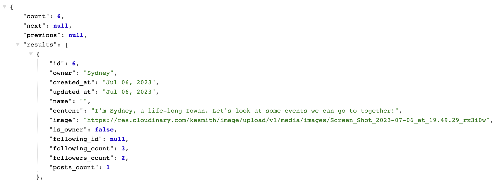

The following fields were added through the profiles serializer to collect further data for the features in the project:

* is_owner
* following_id
* posts_count
* followers_count
* following_count

If the superuser logs in, they can view details of profile information and update or delete it. When editing data, a pre-populated form appears for that user. The save button will save this updated information to the API, while the delete button will remove the information from the API.


## Posts Data

On the Posts List page, all posts created are shown in the API, accompanied by the data, listed below.

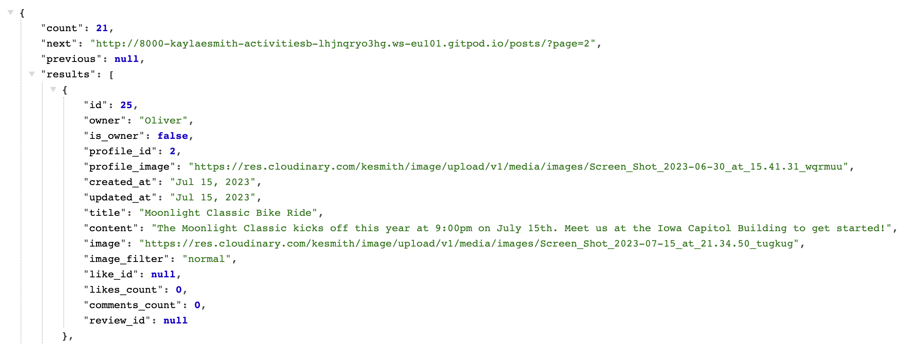

The following fields were added through the profiles serializer to collect further data for the features in the project:

* is_owner
* profile_id
* profile_image
* like_id
* review_id
* likes_count


As a logged-in superuser from the backend, you can create a post for an activity or event by filling out the fields of the form seen below and saving it. This will add an event to the backend API that will also be visible from the frontend website.

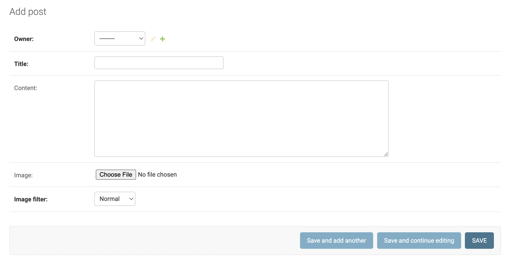

The superuser can also edit the details of or delete any event from the backend API. These changes will be visible from the frontend website as well as the backend.

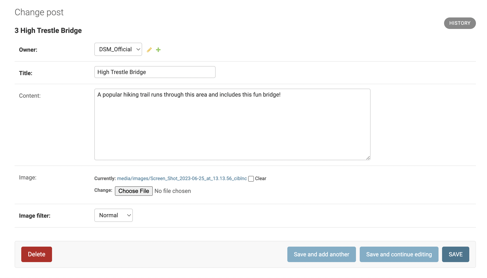

## Comments Data

In the Comments section, you can see a list of all comments in the API.

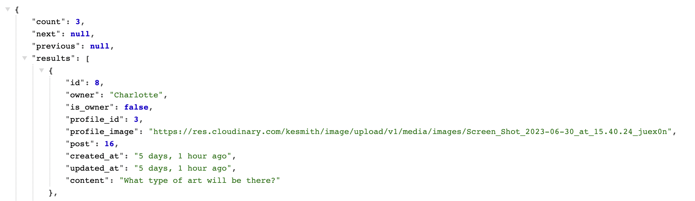

Once logged in as a superuser, you can fill out a form to create a new comment on an activity. From the backend, you can choose the owner, event and write your text. This will be saved to the API and will also show up on the frontend.

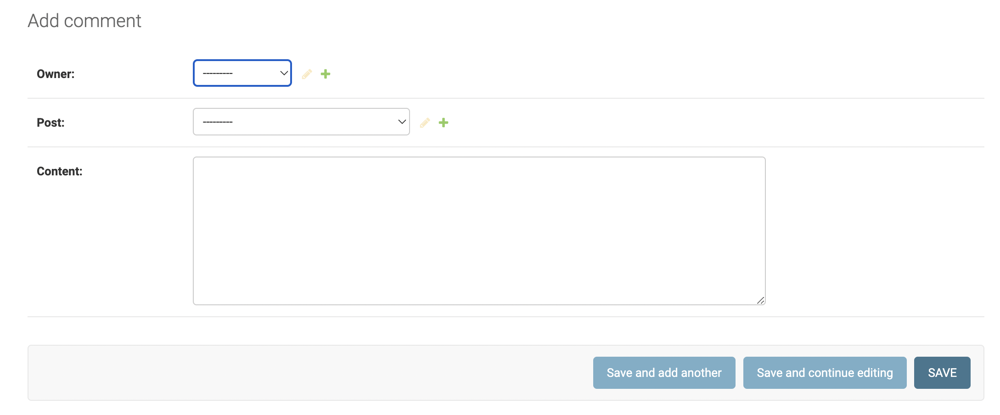

The superuser can also edit a comment from the backend by clicking the comment, changing the pre-populated fields and saving the form. This data will be updated in the API and on the frontend page. Clicking the delete button will erase the information from the API and from the frontend.

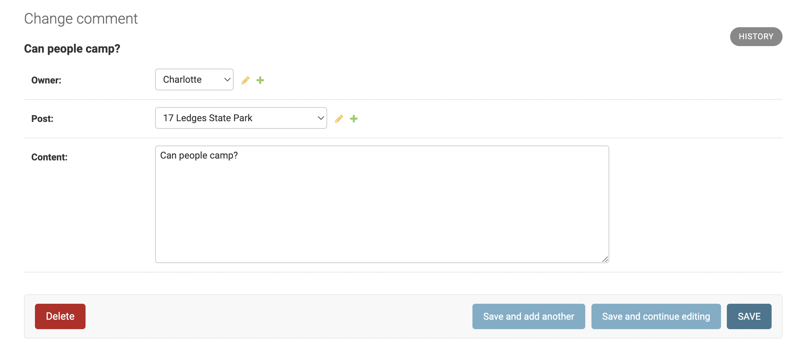

## Followers Data

On the Followers page, all followers of profiles are shown.

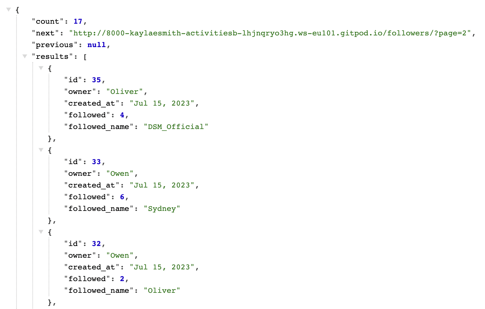

After logging in, the superuser can fill out a form with the 'owner' and 'followed' fields to have a user follow another. 
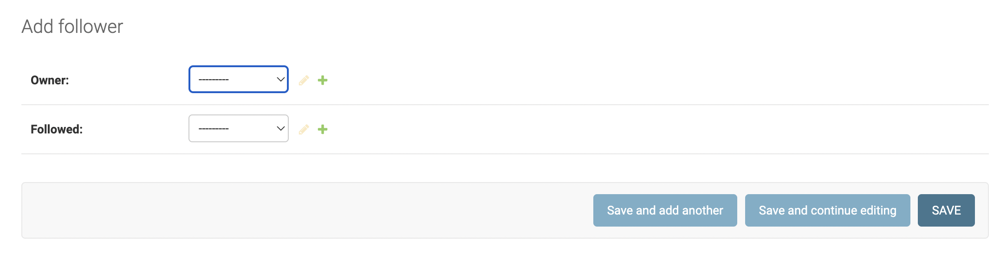

The same superuser can edit the form to change the 'owner' and 'followed' fields. the owner / follower combination can only be used one time, otherwise an error message is shown alerting that the owner is already following the other user.

Clicking the delete button deletes this owner-follower combination from the database.

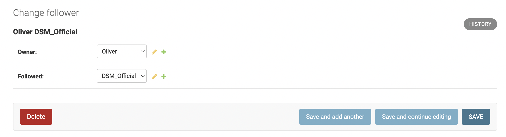

## Reviews Data

Users can see a list of all reviews in the API. 

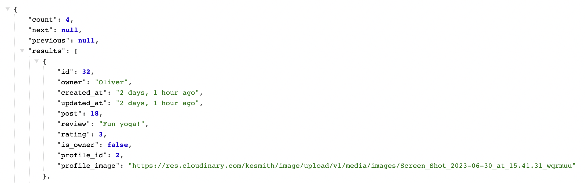

Once logged in as a superuser, the person can create a review by filling out the form fields. Only one review per user per specific event is allowed; an error message will be shown if the same user tries to review the activity a second time.

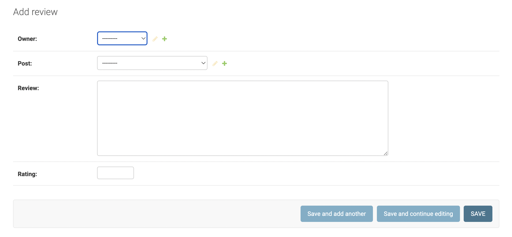

A logged-in super user can also update and delete reviews from the API by clicking the form. The pre-populated fields will appear, as in other forms and the superuser can update the information.

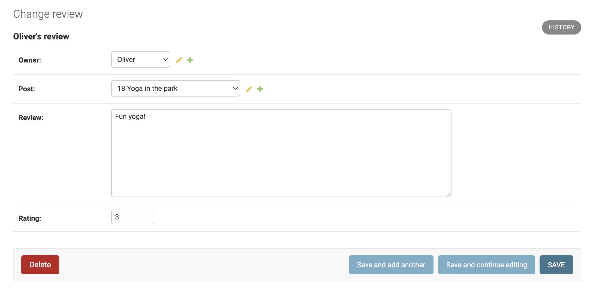


## Contact Data

On the Contact page, users can view all contact messages stored in the API.

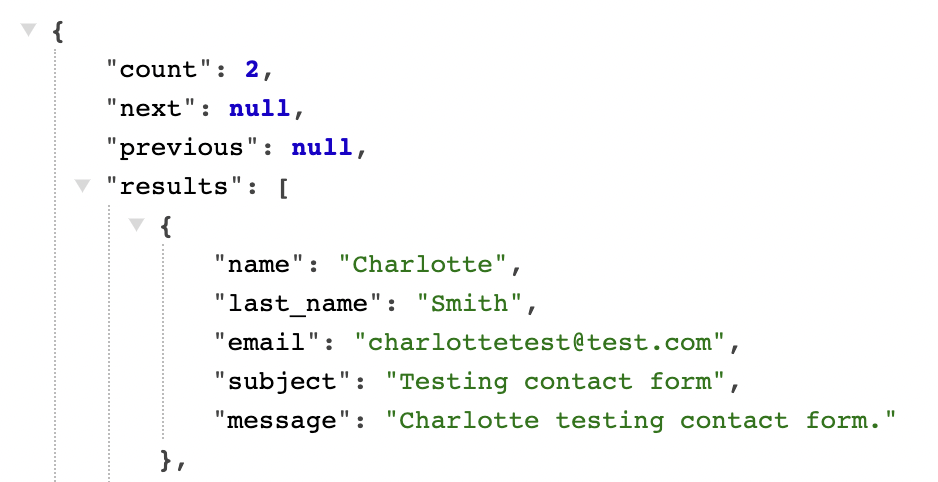

Once the superuser is logged in, they can create a contact message by filling out the form fields. This information will be saved to the API.

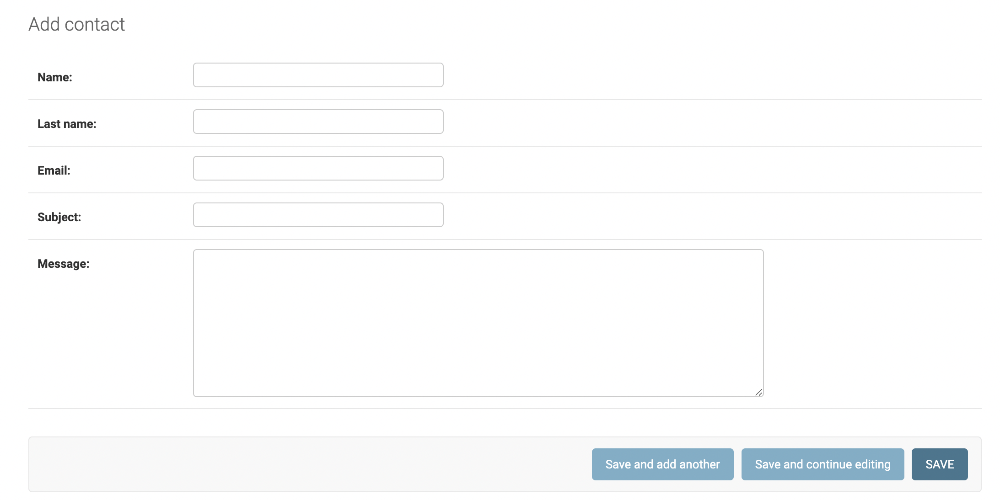

The superuser can also edit the contact form by changing the information in the pre-populated fields and saving it. The updated information will be stored in the database. On this page, the superuser also has the ability to delete the contact form information, which will remove this information from the API and system in general.

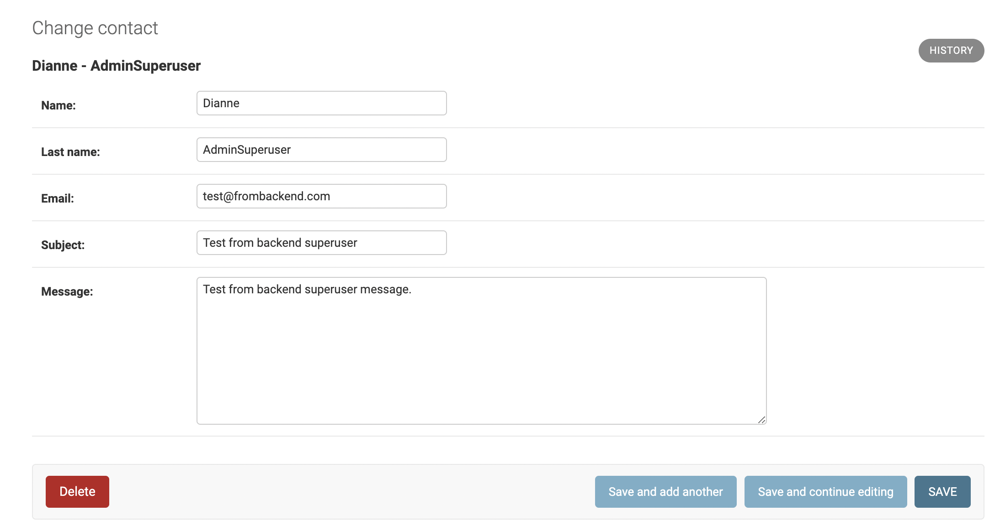

## Likes Data

In the Likes section, users can see a list of the events users have liked.

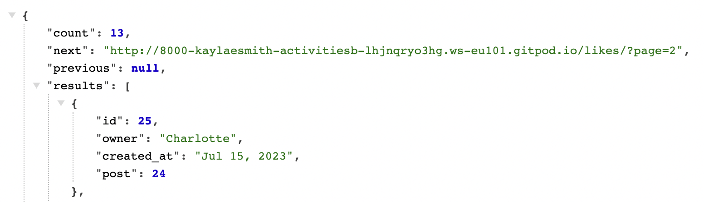

A superuser can create likes by filling out the form with the owner and the event. This information will be saved to the API and displayed on the frontend also.

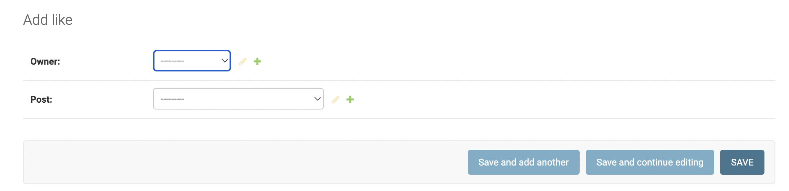

The superuser can also edit or delete the like but entering into the form. The pre-populated fields can be changed and the information saved to update the likes on the backend as well as on the frontend. Deleting a like will erase this information from both the frontend and backend.

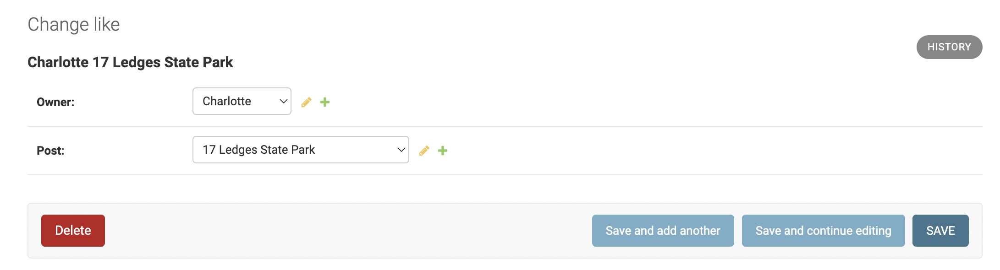

[Back to top](<#table-of-contents>)

# Agile Workflow

## GitHub Project Board

I used the Kanban project board in GitHub to help guide me when creating this API. I used Agile principles throughout from a developer/superuser standpoint to write the 12 EPICS and subsequent user stories for the backend portion of this project. Each user story belongs to one EPIC, as detailed in the Developer User Stories section above. I created one EPIC for each of the seven models in this backend project as well as five more that deal with initial environment set up, deployment, documentation and testing, searching and error pages. 

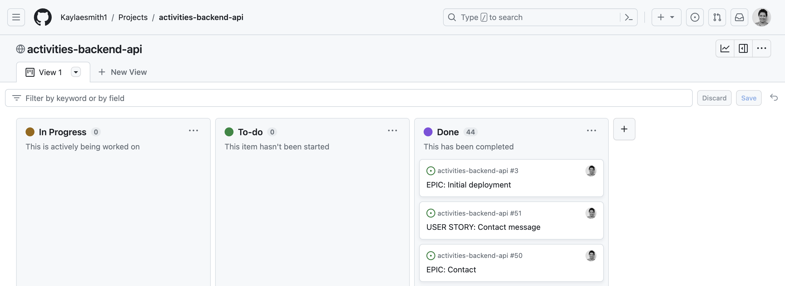

Each user story is prioritized using the MoSCow method, with each EPIC as a 'must have'.

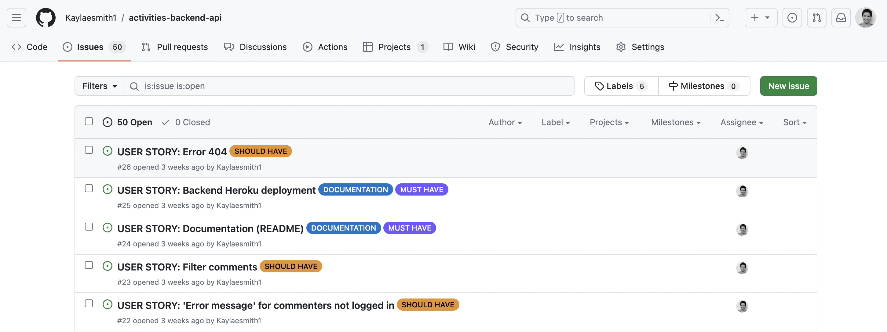

[Back to top](<#table-of-contents>)

# Testing
Click [**here**](TESTING.md) for detailed information on the testing processes completed for the Iowa Summer Activities backend API.

# Technologies Used

## Languages

* [Python](https://en.wikipedia.org/wiki/Python_(programming_language)) - Provides the functionality for the DRF backend framework.

## Frameworks, Libraries & Software

* [Django Rest Framework](https://www.django-rest-framework.org/) - Framework used to build web APIs
* [PEP8 Validation](https://pypi.org/project/pep8/) - A validation tool to check Python code against various style conventions in PEP 8.
* [GitHub](https://github.com/) - Used to host this repository, store commit histories and manage the Kanban project board as a whole.
* [Heroku](https://en.wikipedia.org/wiki/Heroku) - The cloud platform this project is deployed on.
* [Cloudinary](https://cloudinary.com/) - An image hosting service used for this project.
* [Pillow](https://python-pillow.org/) - Pillow is a Python Imaging Library that was used in the walkthrough project and in this backend API.
* [Django Rest Auth](https://django-rest-auth.readthedocs.io/en/latest/#) - Used in this project to provide REST API endpoints for user authentication and registration. 
* [Gunicorn](https://pypi.org/project/gunicorn/) - Gunicorn ‘Green Unicorn’ is a Python WSGI HTTP Server for UNIX. Broadly compatible with various web frameworks, it is quick and easy to install.
* [Psycopg2](https://pypi.org/project/psycopg2/) - PostgreSQL database adapter for the Python programming language used in this project.

[Back to top](<#table-of-contents>)

# Deployment

The project was deployed to [Heroku](https://www.heroku.com). The deployment process is detailed below:

1. To start, create a GitHub repository from the [Code Institute template](https://github.com/Code-Institute-Org/gitpod-full-template). 

2. Click 'Use this template' and ill in the details for the new repository. When that's done, click 'Create Repository From Template'.

3. Once the repository is created, click the green 'Gitpod' button to open the Gitpod workspace.

4. Install necessary libraries like Django, Gunicorn, Psychopg2 and Cloudinary using these commands in the Gitpod terminal:

* ```pip3 install 'django<4'```
* ```pip3 install 'django<4' gunicorn```
* ```pip3 install 'dj_database_url psycopg2```
* ```pip3 install 'dj3-cloudinary-storage```

5. After these preliminary installations, create a requirements.txt file using the command below, which will create and add required libraries to the file:

* ```pip3 freeze --local > requirements.txt```


6. No, create the actual project using:

* ```django-admin startproject project-name ``` 

7. After the project has been created, you can create each app. The current project includes: Profiles, Posts, Comments, Likes, Contact, Followers, and Reviews.

* ```python3 manage.py startapp appname```

8. Add these apps to the settings.py file in the INSTALLED_APPS list.

8. Migrate these new developments and run the server to ensure everything is working properly in the local environment. It's a good idea to start with a 'dry-run' migration to check for any typos or spelling errors. The command for this is:
* ```python3 manage.py makemigrations --dry-run``` 

  Then you can prepare the migrations
* ```python3 manage.py makemigrations```

  and migrate the changes:
* ```python3 manage.py migrate```

  Now run the server by entering the command below. Click the 'open browser' button when it pops up to see the page in your local browser.
* ```python manage.py runserver```

9. Once the above steps are completed, you can create the Heroku app and link the GitHub repository.

    Sign into your [Heroku account](https://www.heroku.com/), and click on 'New' at the top right-hand corner to create a new app.

10. Choose a unique app name, fill out the region and click on the 'Create app' button at the bottom.

11. Next, connect an external PostgreSQL database to the app, using [ElephantSQL](https://customer.elephantsql.com/login). When you've logged in and are on the ElephantSQL dashboard, click 'Create New Instance' to create a new database. Complete the following:
* Name the database
* Select 'Tiny Turtle Free Plan'
* Select data center near you

  then click 'Create Instance'. Return to the ElephantSQL Dashboard and click your newly created database instance. Copy the Database URL and return to Heroku.

12. In the Heroku app settings tab, click 'Reveal Config Vars'. Create a variable called DATABASE_URL and paste the URL you just copied from ElephantSQL. This will connect the database to the app. 

13. Now, in the Gitpod environment, create an env.py file. In this file, add the following code to import the os library, set the environment variables, and keep a secret key, respectively:

* ```import os```
* ```os.environ["DATABASE_URL"]```
* ```os.environ["SECRET_KEY"]```

14. Return to the Heroku Config Vars settings and create a variable called SECRET_KEY. Copy and paste the secret key from the env.py file into this variable. 

    REMEMBER: add the env.py file to the .gitignore file so none of this information is committed and pushed to GitHub and therefore, publicly accessible.

15. Now, to connect to the environment and settings.py file, add the following code to the settings.py file:

* ```import os```

* ```import dj_database_url```

* ```if os.path.isfile("env.py"):```

* ```import env```

16. Then, in the same file, remove the unsafe secret key and replace it with:
```SECRET_KEY = os.environ.get('SECRET_KEY')```

17. Next, set up [Cloudinary](https://cloudinary.com/users/login) to be able to store static files (images, etc). Create or login to your account and copy the API variable from the Cloudinary dashboard.

18. Add the Cloudinary URL to the gitpod environment in the env.py file, making sure it's correct:

```os.environ["CLOUDINARY_URL"] = "cloudinary://************************"```

19. In the Heroku app, add the Cloudinary URL to the Config Vars, along with the DISABLE_COLLECTSTATIC variable (equal to 1) to be able to properly deploy.

20. In the gitpod environment, in the settings.py file, add the installed Cloudinary Libraries to the INSTALLED_APPS list. 

    REMEMBER to put them in this order: 

    * cloudinary_storage
    * django.contrib.staticfiles
    * cloudinary

21. Add the Heroku app and localhost to the ALLOWED_HOSTS list in the settings.py file.

22. Now, create the Procfile directory in the Gitpod environment. Add the following line:

* ```web: gunicorn proj_name.wsgi?```

23. Save the files, commit and push these changes to GitHub. 

24. To deploy in Heroku, select the 'deploy' tab. Scroll down and select 'GitHub' to connect to. Search for your repository and connect them. Then scroll down to manual deployment and click 'deploy branch'.  it's time for deployment. Scroll to the top of the settings page in Heroku and click the 'Deploy' tab. For deployment method, select 'Github'. Search for the repository name you want to deploy and then click connect.

    The deployed Heroku API can be found [here](https://activities-backend-api-a2cb7e703660.herokuapp.com/).
    The backend GitHub repository can be found [here](https://github.com/Kaylaesmith1/activities-backend-api).

[Back to top](<#table-of-contents>)

## Forking this repository on GitHub
You can create an independent copy of this repository by forking the original. Within the copy you can make changes and work without affecting the original. To fork this repository, complete the following: 
- Locate the repository at this link [activities-backend-api](https://github.com/Kaylaesmith1/activities-backend-api).
- At the top of the repository, on the right side of the page, select "Fork" from the buttons available, which creates a copy of the repository.

## Cloning And Setting Up This Project

To clone this repository follow the steps below: 

1. Locate the repository for the [activities-backend-api](https://github.com/Kaylaesmith1/activities-backend-api). 
2. Under **'Code'**, see the different cloning options, HTTPS, SSH, and GitHub CLI. Click the preferred cloning option, and then copy the link provided. 
3. Open **Terminal**.
4. In Terminal, change the current working directory to the desired location of the cloned directory.
5. Type **'git clone'**, and then paste the URL previously copied from GitHub. 
6. Type **'Enter'** to create the local clone. 


# Credits

* When brainstorming which custom models I wanted to include in my project that would be most related to an activities social platform, I came across another student's project, Happening, that had a similar context. The developer created a [Reviews section](https://github.com/quiltingcode/events-backend-api/tree/main/reviews) I thought would be a great addition to the Iowa Summer Activities website. My 'Reviews' app and star rating system is largely based on her custom model.

* My 'Contact' app was developed using another student's repository as a guide. He also created a [Contact model](https://github.com/PEmbarach/drf-api-coffeeie/tree/main/contact), which I used to create my own for Iowa Summer Activities.

* [Lucid chart](https://lucid.app/documents#/documents?folder_id=recent) was used to create the diagram showing the database layout and relationships.

* To add models to the Django backend, Martin from tutoring was helpful in sending [this documentation](https://codinggear.blog/how-to-register-model-in-django-admin/?utm_content=cmp-true).

* Code Institute tutors were helpful on various occasions to walk me through troubleshooting when I had issues with getting the backend up and running. Thanks, tutors!

[Back to top](<#table-of-contents>)