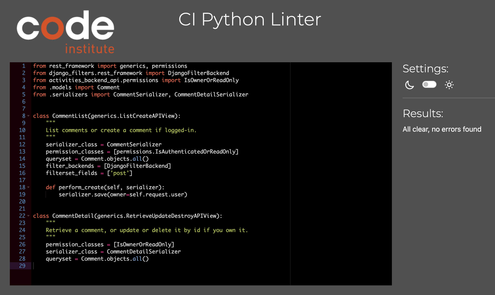
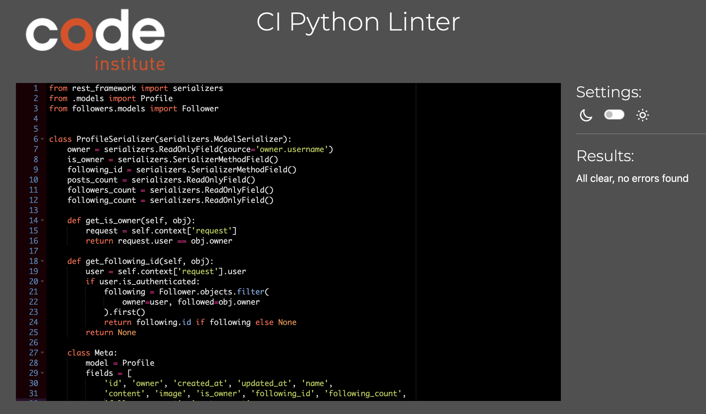

Return to [README](README.md)

# **Iowa Summer Activities API | Testing**

## Table of Contents

* [**Testing**](<#testing>)
    * [Code Validation](<#code-validation>)
    * [Manual Testing](<#manual-testing>)
    * [Bugs](<#known-bugs>)

## Code Validation 

### PEP8

Python codes used throughout the Iowa Summer Activities API were validated using [CI Python Linter](https://pep8ci.herokuapp.com/). 

The most common errors that arose were 'line too long'. This was rectified by adding '  # noqa' to the lines of code in question, which fixed this error.  Please see the results of each component below.

### Activities_backend_api files

  
permissions.py - No errors
 

  
serializers.py - No errors
 

  
settings.py - No errors
 

  
urls.py - No errors
 

 

  
views.py - No errors
 

### Comments App files

  
models.py - No errors
 

  
serializers.py - No errors
 

  
urls.py - No errors
 

  
views.py - No errors
 

 

### Contact App files

  
models.py - No errors
 

  
serializers.py - No errors
 

  
urls.py - No errors
 

  
views.py - No errors
 

 

#### [Back to top](<#table-of-contents>)

### Followers App files

  
models.py - No errors
 

  
serializers.py - No errors
 

  
urls.py - No errors
 

  
views.py - No errors
 

 

### Likes App files

  
models.py - No errors
 

  
serializers.py - No errors
 

  
urls.py - No errors
 

  
views.py - No errors
 

 

### Posts App files

  
models.py - No errors
 

  
serializers.py - No errors
 

  
urls.py - No errors
 

  
views.py - No errors
 

#### [Back to top](<#table-of-contents>)

### Profiles App files

  
models.py - No errors
 

  
serializers.py - No errors
 

  
urls.py - No errors
 

  
views.py - No errors
 

### Reviews App files

  
models.py - No errors
 

  
serializers.py - No errors
 

  
urls.py - No errors
 

  
views.py - No errors
 

#### [Back to top](<#table-of-contents>)

## Manual Testing
I started by ensuring each url path worked properly by running the backend server and manually entering the urls (following the url pathways I have in the activities_backend_api urls.py file). All opened without error.

I then checked CRUD functionality worked properly through the API by logging in as a superuser and testing these features. CRUD functionality should be available for all seven apps: Comments, Contact, Followers, Likes, Posts, Profiles and Reviews.

Once logged in as the superuser, I went through each of the aforementioned apps by url to see if I was able to: create an item, edit an item and delete an item, which I was able to do on all accounts.

I performed manual testing using the Django Rest Framework admin site  throughout the development of this project as a whole. Furthermore, I did manual testing at various steps on the Iowa Summer Activities frontend website, which will be discussed in depth in the TESTING.md file in the frontend documentation.

All API endpoints in this portion of the project pass manual testing by posting, retrieving, updating and deleting data, both through the frontend website as well as through the Django rest framework admin site. 

## Resolved Bug

1. 

    
Contact form error
 

    
    

    In early development of the Contact model, the form was not posting correctly to the backend API. After troubleshooting on my own and speaking with someone from tutoring, I was reminded I needed to migrate new changes to the model and deploy the backend again. This suggestion solved the problem, errors in the console disappeared and my information from the contact form was posted to the backend correctly. 

## Unresolved Bug
There are no other unresolved bugs that I am aware of. Below is a description of the bug identified.

1. 

    
POST / GET errors
 

    
    

    
    These errors show up periodically if the user is not logged in from the frontend website. I spoke to Sean from tutoring and he assured me that this is a known issue and it would not count against my assessment (see below). Furthermore, once the user is logged in the errors disappear, though a hard refresh might be needed.

    

    
Sean's response
 

    
    

    #### [Back to top](<#table-of-contents>)
